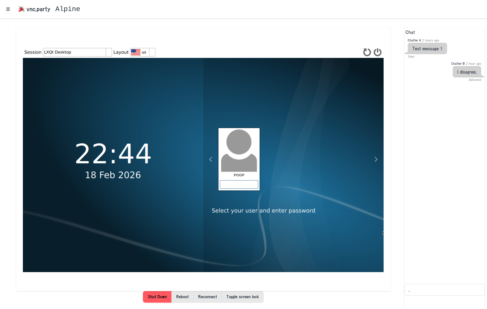

## vncparty
shareable vnc connections in the browser

[Live demo](http://143.110.199.41:1323/room?uuid=50d8c3a7-609a-40f5-9b32-d6cb9f0931be) user/pass: demo/demo

### Build & Run
* Configure a fresh Postgres database
* Configure .env ([example](./.env.default))
* Provide an SSL cert and key
* `go build -o vncparty && ./vncparty`

Works best with QEMU's VNC frontend, use something like this command:

    qemu-system-x86_64 -hda hdd.qcow2 -m 4G --enable-kvm -display none -vnc :1,websocket=15901 -k en-us

## Screenshot

## Roadmap
- [x] Proxy VNC connections
- [x] SSL
- [ ] Automatic cert management
- [ ] Docker image
- [ ] In-room chat
- [ ] MCP support
- [ ] Help text
- [ ] Docker image

